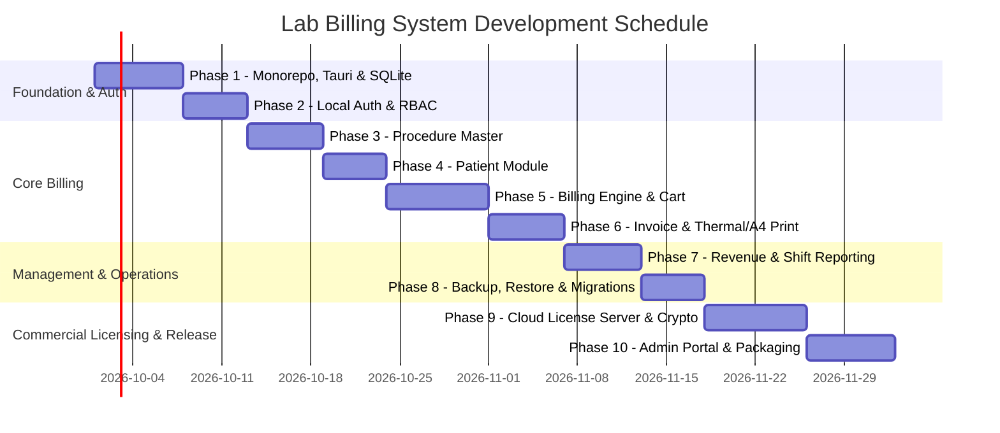

# Lab Billing Application — Detailed Phase-by-Phase Development Plan

An offline-first, lightweight Windows desktop billing application for diagnostic laboratories built on **Tauri 2.x (Rust)**, **React + TypeScript + Tailwind CSS**, local **SQLite**, and an asymmetric device-bound **Licensing Server (Node.js/PostgreSQL + Next.js)**.

---

## 1. System Overview & Technology Stack

| Layer | Technology | Rationale & Specifications |
|---|---|---|
| **Desktop Shell** | Tauri 2.x (Rust) | Minimal footprint (< 50MB RAM), native OS access, zero Chromium overhead. |
| **Frontend UI** | React 19 + TypeScript | High productivity, strict typing, responsive state management. |
| **Styling** | Tailwind CSS | Utility-first, zero runtime CSS overhead, compact custom healthcare theme. |
| **Local Database** | SQLite (WAL Mode via `rusqlite`) | Embedded zero-configuration, robust ACID transactions, fast disk reads. |
| **Calculations** | Shared Engine (TS & Rust) | Guaranteed parity and zero client-side calculation tampering. |
| **Licensing API** | Node.js (Fastify / NestJS) | Asymmetric Ed25519 token issuance, device tracking, renewal management. |
| **Cloud Database** | PostgreSQL | Robust relational structure for customer, license, and device management. |
| **Admin Portal** | Next.js 15 (App Router) | Remote administration for customer onboarding, device reset, and renewals. |
| **Installer** | Tauri NSIS / WiX (`.exe`) | Windows standard installer with Program Files and ProgramData separation. |

---

## 2. Proposed Monorepo Structure

```text
billing-application/
├── apps/
│   ├── desktop/                      # Tauri 2.x + React + TypeScript + Tailwind
│   │   ├── src/                      # React UI (keyboard-optimized, fast)
│   │   │   ├── assets/
│   │   │   ├── components/           # UI primitives (buttons, tables, modals)
│   │   │   ├── features/             # Business modules
│   │   │   │   ├── auth/             # Login, session, user controls
│   │   │   │   ├── billing/          # Fast billing cart, keyboard navigation
│   │   │   │   ├── patients/         # Registration, search, patient history
│   │   │   │   ├── procedures/       # Catalog, categories, pricing
│   │   │   │   ├── revenue/          # Shift reports, revenue dashboard
│   │   │   │   ├── settings/         # Lab header, printers, backup controls
│   │   │   │   └── license/          # Activation modal, device binding status
│   │   │   ├── hooks/                # Custom hooks (useShortcuts, useDebounce)
│   │   │   └── services/             # Tauri IPC bridge wrappers
│   │   └── src-tauri/                # Rust Native Desktop Backend
│   │       ├── src/
│   │       │   ├── db/               # SQLite connection pool, migrations, queries
│   │       │   ├── billing/          # Rust validation engine & sequence generator
│   │       │   ├── license/          # Ed25519 verification & hardware fingerprint
│   │       │   ├── printing/         # Native print dispatch (Thermal / A4 / PDF)
│   │       │   ├── commands/         # Tauri IPC command handlers
│   │       │   └── main.rs
│   │       ├── Cargo.toml
│   │       └── tauri.conf.json
│   ├── license-api/                  # Node.js Licensing Backend (Fastify/PostgreSQL)
│   │   ├── src/
│   │   └── package.json
│   └── admin-portal/                 # Next.js 15 Web Dashboard for software vendor
│       ├── src/
│       └── package.json
├── packages/
│   ├── shared-types/                 # Shared TypeScript interfaces (Patient, Bill, License)
│   ├── validation/                   # Shared Zod schemas for forms and IPC payloads
│   └── billing-engine/               # Pure calculation logic (subtotal, taxes, discounts)
├── database/
│   └── migrations/                   # SQLite schema migrations
├── docs/                             # Architecture and workflow documentation
├── pnpm-workspace.yaml
├── turbo.json
└── package.json                      # Workspace root
```

---

## 3. Phase-by-Phase Development Plan

---

### Phase 1: Foundation, Monorepo & Desktop Runtime Environment
**Goal:** Establish monorepo workspace, initialize Tauri 2.x desktop container, configure SQLite with WAL mode, and establish Windows standard paths.

#### Key Tasks:
1. **Monorepo Setup & Tooling**:
   - Initialize `pnpm` workspace with `pnpm-workspace.yaml` and `turbo.json`.
   - Configure shared ESLint, Prettier, and TypeScript base configurations (`tsconfig.base.json`).
   - Setup shared packages: `@lab/shared-types`, `@lab/validation`, and `@lab/billing-engine`.
2. **Tauri 2.x Desktop Container**:
   - Initialize Tauri 2.x in `apps/desktop` with React 19 + TypeScript.
   - Configure Tailwind CSS with a tailored, high-contrast, low-overhead palette for healthcare environments.
   - Configure Vite build optimization (code splitting, tree-shaking Lucide icons, disabling heavy source maps in production).
   - Target configuration: Windows 10/11 x64, 4GB RAM baseline target.
3. **Windows Filesystem & Directory Standards**:
   - Implement Rust directory resolver targeting Windows standard locations:
     - App Binary: `C:\Program Files\LabBilling\`
     - Data Root: `C:\ProgramData\LabBilling\`
       - `database/labbilling.db`
       - `backups/`
       - `exports/`
       - `logs/`
   - Automatic initialization of directories on app startup with appropriate Windows permissions.
4. **SQLite Database Engine & Migration Runner**:
   - Implement connection pool in Rust using `r2d2_sqlite` and `rusqlite`.
   - Configure critical SQLite PRAGMAs on connection:
     ```sql
     PRAGMA journal_mode = WAL;
     PRAGMA synchronous = NORMAL;
     PRAGMA foreign_keys = ON;
     PRAGMA busy_timeout = 5000;
     PRAGMA cache_size = -2000; -- 2MB page cache
     ```
   - Implement migration runner (`db::migrations`) with schema version tracking table `schema_migrations`.
   - Setup structured daily rolling logging using `tracing` and `tracing-appender` to `C:\ProgramData\LabBilling\logs\app.log`.

**Deliverables:**
- Desktop app boots in <2 seconds, connects to local SQLite in WAL mode, applies initial migration, and displays offline status in custom titlebar.

---

### Phase 2: Local Authentication, RBAC & Audit System
**Goal:** Provide secure, role-based offline authentication and tamper-evident audit logging.

#### Key Tasks:
1. **Database Schema (`001_users_and_audit.sql`)**:
   - `users`: `id`, `username`, `password_hash`, `role` (`ADMIN`, `CASHIER`), `status` (`ACTIVE`, `INACTIVE`), `created_at`, `updated_at`, `last_login_at`.
   - `audit_logs`: `id`, `user_id`, `action`, `entity`, `entity_id`, `old_value`, `new_value`, `created_at`.
2. **Cryptography & Session Management in Rust**:
   - Password hashing using **Argon2id** (`argon2` crate) with parameters tuned for low-spec dual-core CPUs (<300ms hashing time).
   - Seed initial Administrator user (`admin` / default prompt to set secure password on first boot).
   - In-memory session store in Tauri managed state:
     - Session token issued on successful login.
     - Role attached to session state (`Admin` or `Cashier`).
     - Guards on all sensitive Tauri commands (`require_admin!(session)`).
3. **Frontend Authentication & Role Gates**:
   - Clean, keyboard-friendly Login modal/screen (Enter to submit, autofocus on username).
   - Role-based route guards in React:
     - **Cashier**: Can access Billing, Patient search, Invoice reprint. Blocked from Revenue reports, User management, Settings, and DB Restore.
     - **Admin**: Full access.
   - Audit logging helper in Rust: captures user logins, logouts, privilege attempts, and data mutations.

**Deliverables:**
- Secure local login with Admin and Cashier roles, session expiration, and complete audit tracking.

---

### Phase 3: Procedure Master & Categorization
**Goal:** High-speed lab test/procedure catalog management with search latency < 100ms.

#### Key Tasks:
1. **Database Schema (`002_procedure_master.sql`)**:
   - `procedure_categories`: `id`, `name`, `status` (`ACTIVE`, `INACTIVE`), timestamps.
   - `procedures`: `id`, `code` (unique index), `name` (index), `category_id` (foreign key), `sample_type`, `department`, `price` (cents/integer or exact decimal), `status` (`ACTIVE`, `INACTIVE`), timestamps.
2. **Backend Repository & Rust IPC Commands**:
   - `get_procedures(query, category_id, status)`: Sub-50ms indexed search matching code or name prefix/contains.
   - `upsert_procedure(payload)`: Validates unique code and pricing > 0.
   - `set_procedure_status(id, status)`: Soft-activation/deactivation. Never hard deletes records to maintain billing referential integrity.
   - `get_procedure_categories()` and `upsert_category(name)`.
3. **Frontend Catalog Management UI**:
   - Procedure list with live debounce search (<200ms target).
   - Category filtering tabs and status toggle (`Active` / `Inactive`).
   - Modal/Drawer for adding and editing procedures with validation via Zod.
   - Price change confirmation dialog with automatic audit log recording.
   - Quick CSV Import / Export for initial procedure setup.

**Deliverables:**
- Fast, keyboard-navigable procedure master with search, category filtering, and soft-delete safeguards.

---

### Phase 4: Patient Registration & Search Module
**Goal:** Quick patient search and registration with sub-200ms lookup times and auto-generated IDs.

#### Key Tasks:
1. **Database Schema (`003_patients.sql`)**:
   - `patients`: `id`, `patient_code` (unique index, e.g. `P000001`), `name` (index), `age`, `gender` (`MALE`, `FEMALE`, `OTHER`), `mobile` (index), `address`, timestamps.
2. **Auto-Incrementing Patient ID Sequence**:
   - Transactional sequence generator in Rust: formats sequential numbers as `P000001`, `P000002` safely under concurrent requests.
   - Indexed multi-field search: lookup by Patient Code, Mobile Number, or Patient Name with fast partial matching (`LIKE 'query%'`).
3. **Frontend Patient UI & Billing Integration**:
   - Dedicated Patient Registry view with pagination/virtualization for large datasets (10,000+ patients).
   - Quick Patient Search modal within the billing workflow:
     - Type mobile number or name.
     - If existing: select with arrow keys + `Enter`.
     - If new: press `+` or shortcut `Alt+N` to open inline quick-creation form without leaving the billing screen.
   - Patient History view: drawer showing historical bills, tests taken, and outstanding dues.

**Deliverables:**
- Sub-200ms patient search and inline registration seamlessly integrated into the billing flow.

---

### Phase 5: High-Speed Billing Engine & Transaction Processing
**Goal:** The core billing engine: keyboard-driven, fast, deterministic calculations, atomic invoice numbering, and transactional persistence.

#### Key Tasks:
1. **Database Schema (`004_billing_system.sql`)**:
   - `bills`: `id`, `bill_number` (unique index, e.g. `LAB-2026-000001`), `patient_id` (foreign key), `bill_date`, `subtotal`, `discount`, `tax`, `round_off`, `grand_total`, `payment_status` (`PAID`, `PARTIAL`, `UNPAID`), `status` (`ACTIVE`, `CANCELLED`), `created_by`, timestamps.
   - `bill_items`: `id`, `bill_id` (foreign key), `procedure_id`, `procedure_code`, `procedure_name`, `quantity`, `rate`, `discount`, `amount`. (Crucial: stores historical snapshot of procedure name and rate).
   - `payments`: `id`, `bill_id` (foreign key), `payment_mode` (`CASH`, `UPI`, `CARD`, `BANK_TRANSFER`, `OTHER`), `amount`, `reference_number`, `paid_at`, `created_by`.
   - `bill_cancellations`: `id`, `bill_id` (foreign key), `reason`, `cancelled_by`, `cancelled_at`.
2. **Deterministic Calculation Engine**:
   - Implement calculation logic in `@lab/billing-engine` (TypeScript) and duplicate in Rust backend (`billing::engine`):
     - `Subtotal = Σ(quantity × rate)`
     - `Total Discount = Σ(item_discounts) + bill_discount`
     - `Tax = Σ(applicable_tax)`
     - `Round Off = round_to_nearest_integer(Subtotal - Discount + Tax) - (Subtotal - Discount + Tax)`
     - `Grand Total = Subtotal - Discount + Tax + Round Off`
   - Rust backend enforces server-side validation: recalculates all line items and totals inside SQLite transaction before committing.
3. **Atomic Bill Numbering Generator**:
   - Configuration table `app_settings` stores:
     - `invoice_prefix`: (e.g. `LAB`)
     - `financial_year`: (e.g. `2026-27`)
     - `current_sequence`: atomic counter incremented inside the bill creation SQLite transaction.
4. **Rapid Keyboard-First UI**:
   - Billing screen designed for receptionists:
     - `F2`: New Bill
     - `F4`: Focus Patient Search
     - `F6`: Focus Procedure Search
     - Arrow Keys + `Enter`: Add item to cart
     - Tab navigation through Qty, Discount, Payment mode
     - `Ctrl + S`: Save Bill
     - `Ctrl + P`: Save & Print Bill
     - `Esc`: Cancel / Close
   - Real-time calculations with large, high-visibility Grand Total display.
   - Bill Cancellation modal with mandatory cancellation reason and cashier restrictions.

**Deliverables:**
- End-to-end billing workflow capable of generating a bill in < 15 seconds with complete transactional safety.

---

### Phase 6: Invoice Formatting, Print Engine & Thermal/A4 Support
**Goal:** Production-grade invoice printing supporting both 80mm thermal receipt printers and A4 standard page formats.

#### Key Tasks:
1. **Invoice Layouts**:
   - **80mm Thermal Receipt Template:**
     - Compact typography, monospaced layout compatibility.
     - Lab Name, Address, Contact, Bill Number, Date & Time, Patient Details.
     - Itemized table: Test Name, Qty, Rate, Amount.
     - Subtotal, Discount, Grand Total, Payment Mode (UPI/Cash).
     - Custom footer ("Get well soon", Lab Timings).
   - **A4 Standard Invoice Template:**
     - Full diagnostic center letterhead format.
     - Barcode / QR code for bill number / UPI payment verification.
     - Detailed disclaimer and authorized signature box.
2. **Print Execution Architecture**:
   - Tauri IPC command `print_invoice(bill_id, print_mode, printer_name)`:
     - Native print preview dialog using HTML/CSS `@media print` styling.
     - Silent/Direct printing option for thermal roll printers without showing the OS print dialog each time.
   - Direct PDF export: generates PDF using headless Chromium print-to-pdf or native Rust PDF rendering to `C:\ProgramData\LabBilling\exports\`.
   - Invoice Reprint feature: watermark `[DUPLICATE / REPRINT]` stamped on all subsequent prints with reprint timestamp.

**Deliverables:**
- Crisp, reliable printing on both 80mm thermal roll printers and standard A4 printers with one-click PDF export.

---

### Phase 7: Revenue Metrics, Cashier Register & Reporting
**Goal:** Accurate financial tracking, daily cashier reconciliation, and management reports.

#### Key Tasks:
1. **Real-Time Dashboard Metrics**:
   - Lightweight KPI cards (no heavy charting libraries):
     - Today's Total Revenue
     - Today's Bill Count
     - Split Collections: Cash, UPI, Card, Bank Transfer
     - Monthly Aggregate Revenue
     - Recent Bills table with quick actions (View, Reprint, Cancel).
2. **Cashier Reconciliation / Shift Register**:
   - Daily collection summary by Cashier user:
     - Cash received vs recorded.
     - UPI transaction list with reference numbers.
     - Shift closing report for day-end handover.
3. **Detailed Financial Reports**:
   - Indexed aggregation queries in SQLite:
     - Date Range Collection Report (`From Date` → `To Date`).
     - Procedure-wise Volume & Revenue (e.g. Top tests: CBC, LFT, TSH).
     - Cancellation & Refund Audit Report.
     - Discount Audit Report.
   - Export formats: CSV, Excel (`xlsx`), and printable summary PDF.

**Deliverables:**
- Instantaneous revenue reporting (< 2s for 100k records) and reliable cashier shift reconciliation.

---

### Phase 8: Database Administration, Automated Backups & Disaster Recovery
**Goal:** Zero data-loss architecture for local SQLite database, manual/scheduled backups, and admin-authenticated restore.

#### Key Tasks:
1. **SQLite Health & Checkpoint Management**:
   - Automated WAL checkpointing (`PRAGMA wal_checkpoint(TRUNCATE)`) on app shutdown.
   - Periodic integrity verification: `PRAGMA integrity_check` executed on startup.
2. **Backup Engine**:
   - **Manual Backup:**
     - One-click backup to USB, external drive, network path, or local folder.
     - Timestamped naming: `LabBilling_Backup_YYYY-MM-DD_HHMMSS.db`.
   - **Automated Backup:**
     - Configurable daily/weekly backup to secondary storage.
     - Pre-update snapshot: automatic backup before applying any app updates or database migrations.
3. **Safe Database Restore**:
   - Restricted to Admin role only; requires re-entering Admin password.
   - Safety protocol:
     1. Creates safety backup of existing live database before initiating restore.
     2. Closes existing SQLite connection pool.
     3. Replaces active file `labbilling.db` with validated backup file.
     4. Runs integrity check and migration sync on restored database.
     5. Re-initializes connection pool and logs audit event.

**Deliverables:**
- Bulletproof backup and restore mechanism protecting lab data against disk failure, accidental corruption, or hardware upgrades.

---

### Phase 9: Cloud Licensing Server & Hardware-Bound Activation
**Goal:** Commercial device-bound licensing system with Ed25519 asymmetric signatures and offline grace period.

#### Key Tasks:
1. **Cloud Licensing Server (`apps/license-api`)**:
   - Fastify / NestJS API backed by PostgreSQL.
   - Database Schema:
     - `customers`: `id`, `name`, `contact_name`, `email`, `phone`, `status`, timestamps.
     - `licenses`: `id`, `customer_id`, `license_key_hash`, `plan` (`MONTHLY`, `ANNUAL`, `LIFETIME`), `status` (`ACTIVE`, `SUSPENDED`, `REVOKED`), `max_devices`, `expires_at`.
     - `devices`: `id`, `license_id`, `device_id`, `fingerprint_hash`, `device_name`, `activated_at`, `last_seen_at`, `status`.
     - `activations`: `id`, `license_id`, `device_id`, `action`, `ip_address`, timestamps.
     - `license_events`: audit trail for license modifications.
2. **Hardware Fingerprinting Engine (Rust Client)**:
   - Collect normalized machine identifiers:
     - Motherboard UUID (via Windows WMI / registry).
     - Primary Disk Serial Number.
     - CPU Processor ID.
   - Normalize and compute cryptographic hash: `SHA-256(Motherboard_UUID + Disk_Serial + CPU_ID)`.
   - Protects customer privacy by hashing raw values before transmission.
3. **Cryptographic Asymmetric Token System**:
   - Server holds **Ed25519 Private Signing Key**.
   - Client desktop app embeds **Ed25519 Public Verification Key**.
   - Activation Flow:
     1. User enters License Key in desktop app.
     2. Client sends `{ license_key, device_fingerprint, device_name }` to License API over HTTPS.
     3. Server validates license, checks device count, registers device, and signs a payload containing `{ license_id, plan, expires_at, device_fingerprint, validation_expiry }`.
     4. Client receives token, verifies signature with public key, and saves it in encrypted local storage (`C:\ProgramData\LabBilling\license.dat`).
4. **Offline Operation & Periodic Validation**:
   - Client checks signature and expiration locally on every app start without requiring internet.
   - Anti-clock-tampering: compares current system clock against last verified transaction timestamp.
   - Periodic validation: Background thread pings License API every 30/60 days if internet is present to refresh validation token. Normal billing remains 100% functional offline throughout the grace window.

**Deliverables:**
- Tamper-resistant, device-bound commercial licensing with seamless offline capability.

---

### Phase 10: License Admin Portal, Windows Packaging & Production Release
**Goal:** Internal management web portal, automated Windows installer packaging, code signing, and release validation.

#### Key Tasks:
1. **Web Admin Portal (`apps/admin-portal`)**:
   - Next.js 15 + Tailwind CSS administrative dashboard for software vendor operations.
   - Features:
     - Create and issue new customer licenses.
     - View real-time registered devices and last check-in times.
     - **PC Replacement / Reset Device:** Release old device registration to allow customer to activate a new replacement PC.
     - Suspend, revoke, or extend license validity.
2. **Tauri Windows Installer Pipeline**:
   - Tauri NSIS / WiX configuration:
     - Bundles application into `LabBilling-Setup-1.0.0.exe`.
     - Configures installation path to `C:\Program Files\LabBilling\`.
     - Configures data initialization in `C:\ProgramData\LabBilling\`.
     - Creates Desktop and Start Menu shortcuts.
     - Uninstaller preserves database folder by default (with user confirmation).
   - Windows Code Signing setup (Authenticode) to eliminate Windows SmartScreen warnings.
3. **End-to-End V1 Release Checklist & Hardware Benchmark**:
   - Verify startup time < 3 seconds on 4GB RAM Windows 10/11 benchmark PC.
   - Verify full offline operation with network adapter disabled.
   - Verify printer outputs on both 80mm thermal and A4 printers.
   - Stress test with 100,000 simulated bills to verify query response times remain < 200ms.

**Deliverables:**
- Production-ready Windows `.exe` installer, functional Admin Portal, and certified release documentation.

---

## 4. Hardware & Performance SLA Benchmarks

| Metric | Target SLA | Strategy to Guarantee |
|---|---|---|
| **App Cold Startup** | < 3 seconds | Tauri native Rust binary, no browser process initialization, async DB connect. |
| **New Bill Screen Open** | < 500 ms | Lightweight React components, pre-warmed SQLite queries. |
| **Patient / Test Search** | < 100 ms | SQLite prefix index (`B-Tree`), indexed columns (`code`, `name`, `mobile`). |
| **Save Bill Transaction** | < 250 ms | SQLite WAL mode, in-memory calculation validation before write lock. |
| **Revenue Aggregation** | < 1.5 seconds | Indexed date-range queries (`bill_date`, `status`, `payment_mode`), compiled SQL. |
| **Idle Memory Footprint** | < 100 MB RAM | Minimal dependencies, no heavy canvas/3D graphics, aggressive memory release. |

---

## 5. Development Timeline & Execution Sequence


